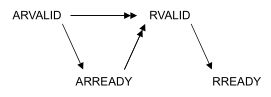
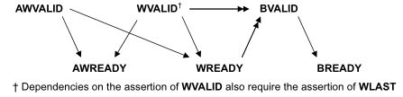
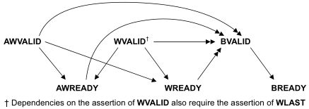

# Axi

## Axi3 vs axi4

1. AXI3 supports burst lengths up to 16 beats only. While AXI4 supports burst lengths of up to 256 beats.
2. AXI3 supports write interleaving. AXI4 does NOT support write interleaving
3. AXI3 supports locked transfers, AXI4 does NOT support locked transfers
4. AXI4 supports QoS (Quality of Service), AXI3 does NOT support QoS.
5. AXI4 supports optional 'USER' signals. AxUSER, WUSER, RUSER, BUSER. These can be used as sideband signals to pass user defined data from end2end. The protocol does not define the use of these signals, so the users have to be careful to use it in a 'local' env, without the expectation that any standard IP would.
   1. Support them
   2. Support them for the same intended purpose.
6. AXI4 supports Regions. AxREGION signals. These are region identifier signals sent as AWREGION or ARREGION.
These can be max 4 bits wide identifying up to max 16 different regions. These can be used by a single slave to have
multiple decode regions.
7. You can also see at times that AXI4 Slave may not have WID signal. The WID always has to match corresponding AWID
and in absence of write-interleaving support in AXI4, the information on WID becomes redundant.
      Hence you may see AXI4 Slaves and even Masters for that matter without the WID signal.
      In fact in AXI4 and for that matter in AXI5, the WID signals cam be completely ignored.

      Many IP providers e.g. Synopsys supporting burst lengths up to 256 beats in AXI3
      Many IP providers e.g. Synopsys NOT supporting write interleaving in AXI3.

      Looks like the industry norm is to use AXI3 with burst lenghts up to 256 beats without support for write Interleaving.

## Out of order

In AXI, a transfer is not completed until the bus master receive the response from the read data channel or write response channel. Also after a bus master issue a transfer, it can issue another transfer without waiting for the first one to complete. __If the order of the responses coming back from the slaves arrived in different order from the order that the transfers were issued, we can call it out of order completion.__

The order transactions are sent and the order the responses were received is not same.

## Outstanding

When master initiates a transaction without waiting it to complete, it can issue next transaction.

## Responses
xRESP[1:0] | Responses
------ | --------
OKAY   | Normal access success.
EXOKAY | Exclusive access okay.
SLVERR | Slave error. Used when the access has reached the slave successfully, but the slave wishes to return an error condition to the originating master
DECERR | Decode error. Generated, typically by an interconnect component, to indicate that there is no slave at the transaction address

## [Exclusive transfer - mechanism](https://blogs.synopsys.com/vip-central/2016/08/24/amba-axi-exclusive-access-de-mystified/)
* Exclusive accesses are a sequence of read transactions followed by write transactions to the same address range.
* The exclusive write access of the master is signaled as successful if no other master has written to that location between the read and write accesses, failed if another master has written to that location between the read and write accesses. In this case the address location is not updated.
###  Exclusive access restrictions
2. The burst size and burst length of an exclusive write with a given ID must be the same as the burst size and burst length of the preceding exclusive read with the same ID.
3. The address of an exclusive access must be aligned to the total number of bytes in the transaction, that is, the product of the burst size and burst length.
4. The addresses for the exclusive read and the exclusive write must be identical.
5. The ARID value of the exclusive read must match the AWID value of the exclusive write.
6. The control signals for the exclusive read and exclusive write transactions must be identical.
7. The number of bytes to be transferred in an exclusive access burst must be a power of 2, that is, 1, 2, 4, 8, 16, 32, 64, or 128 bytes.
8. The maximum number of bytes that can be transferred in an exclusive burst is 128.
9. In AXI4, the burst length for an exclusive access must not exceed 16 transfers.
10. The value of the AxCACHE signals must guarantee that the slave that is monitoring the exclusive access sees the transaction. For example, an exclusive access must not have an AxCACHE value that indicates that the transaction is Cacheable.
### Types
* An Exclusive Read can be followed by Normal Read or Write operation.
* A master might not complete the write portion of an exclusive operation.
* An Exclusive Read can follow an Exclusive Read with same ARID value as previous exclusive read and reset the monitor to a different address location.
* There can be two Exclusive Reads monitoring the same address region.
* An exclusive read/write to a slave which does not support Exclusive access.

When exclusive fails, that location will not be updated

## Awlock
AxLOCK[1:0] | Access type
----------- | -----------
0b00        | Normal access
0b01        | Exclusive access
0b10        | Locked access
0b11        | Reserved

## Locked transfer - diff with exclusive
AxLOCK signals are used by the Masters for a locked access to a slave and it's the arbiter/interconnect which takes care of the AxLOCK signal.
The interconnect much ensure that only the master is allowed access to the slave until an unlocked transfer from the same master completes.

## When both are asserted who has the preference
*need to look up*
## Interleaving
* With write data interleaving, a slave interface can accept interleaved write data with different AWID values.
* The write data interleaving depth is the number of addresses for which a slave can accept interleaved data.
* When accessing a slave that supports write data interleaving, write data from different transactions that use the same AWID cannot be interleaved.
## Axi handshake
All five transaction channels use the same VALID/READY handshake process

Types : VALID before READY | VALID after READY | VALID with READY

Def|Elaboration
---|---
Write strobe | a byte lane strobe signal for every eight data bits, indicating which bytes of the data are valid.
Narrow transfer | In incrementing or wrapping bursts, different byte lanes are used on each beat of the burst. In a fixed burst, the same byte lanes are used on each beat.
Unaligned transfer | Use the low-order address lines to signal an unaligned start address. Provide an aligned address and use the byte lane strobes to signal the unaligned start address.
## [Out of order testcase](https://github.com/taichi-ishitani/tvip-axi)
## Coverage in axi
*need to look up*
#UVM
## Uvm pros and cons
## Copy clone create
## Do-copy do-clone where are they
## Passive to active of agent
## Start a test
## Run_test
## Pre and post body - how to disable
## Rand-mode 0
## Seq arbitration
## Exclusive access for the seqr
## M and p seqr
## Default seqr
## Get vs get-next-item
## Factory
## New vs create
## Cross coverage
## Types of constraints
## Modport vs clockingblock
## @ vs wait
